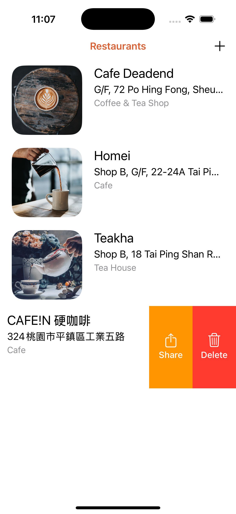
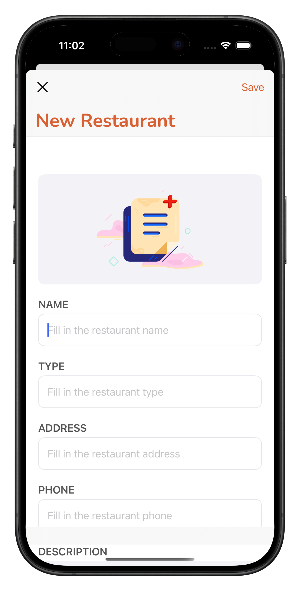

# FoodPin

可以讓你儲存自己有興趣的餐廳, 可以給予愛心及 emoji 評價
目前只有將資料處存於程式內(SwiftData), 若刪除 app 資料庫則被重置

  
  &nbsp
  
  &nbsp
  

- 儲存自己喜愛的餐廳  
- 功能包括：
  - 新增/刪除餐廳  
  - 搜尋餐廳功能(依照名字或地點搜尋)
  - TableView Rows 左/右滑動功能(加入愛心/刪除/分享)  
  - 地圖大頭針顯示地點
  - 給予餐廳回饋 emoji 

---

**App Description:**

an app letting you save the restaurants you are interested in and give them a feedback through emoji
it's only for local storage now, datas disappeared onece you delete the app

---

**此為 AppCoda 上的課程學習專案**  
🔗 [AppCoda](https://www.appcoda.com.tw/)
